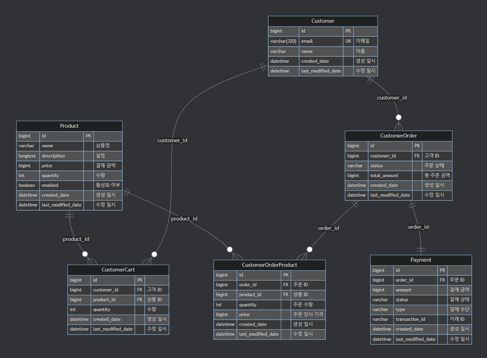
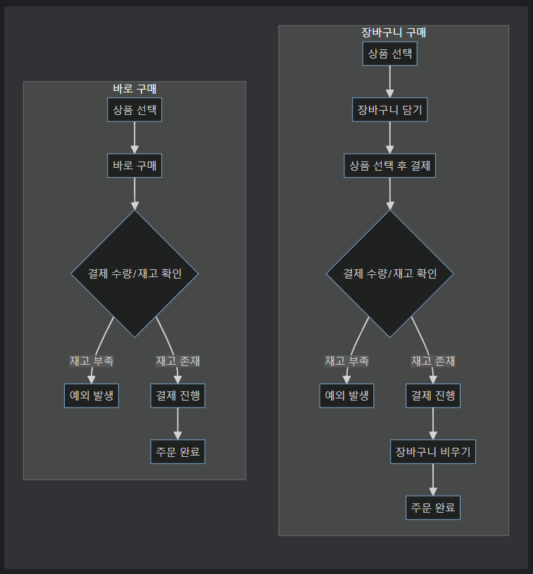

### 개발자 : 배소연
프로젝트 기간 : 2025.02.13 ~ 2025.02.16
<br><br>

# 🛍️ 올라 마켓 API
올라 마켓 API는 상품 관리, 장바구니 관리, 주문 조회, 결제를 제공합니다.  
도메인을 기준으로 패키지를 구성하여 각 도메인(상품, 장바구니, 결제)의 독립성과 응집도를 고려하여 개발하였습니다.

사용자는 별도의 로그인 없이(더미 데이터 사용) 장바구니에 상품을 담고 구매하는 형태로 서비스를 이용할 수 있습니다.
<br><br><br>

## 🛠️ 개발 환경
### 💻 Backend
  [](https://spring.io/projects/spring-boot)
  [](https://www.oracle.com/java/)
  [](https://gradle.org/)
  [](https://www.oracle.com/java/technologies/persistence-jsp.html)
  [](http://querydsl.com/)
  [](https://spring.io/projects/spring-cloud-openfeign)

### 🗄️ Database
[](https://mariadb.org/)

### 🔧 Development Tools
[](https://www.jetbrains.com/idea/)
[](https://github.com/)
[](https://www.postman.com/)
[](https://beeceptor.com/)
<br><br><br>

## 📁 프로젝트 구조
```text
src
├── main
│   ├── java
│   │   └── com.allra.market
│   │       ├── controller    # API endpoint
│   │       ├── service       # 비즈니스 로직
│   │       ├── domain        # 도메인 로직
│   │       │   ├── customer  # 사용자 도메인
│   │       │   ├── payment   # 결제 도메인
│   │       │   └── product   # 상품 도메인
│   │       └── core          # 공통 설정
│   └── resources
│       └── profile
│           └── local         # local 환경 설정
```
<br><br><br>

## 📜 ERD

<br><br><br>

## 🚀 시작하기 
### 👤 Profile 설정
profile을 `local`로 설정하여 빌드 및 실행합니다.

### ⚙️ DB 설정
`resources/profile/local/database.yml`에서 DB 정보를 설정합니다.
```yaml
spring:
  datasource:
    hikari:
      driver-class-name: org.mariadb.jdbc.Driver
      jdbc-url: jdbc:mariadb://localhost:3306/allra_market
      username: { username }
      password: { password }
      pool-name: SpringBoot-3.4.2
```

### 📫 Postman 설정
`description/postman` 폴더에 있는 `올라 마켓.postman_collection.json`을 import하여 API 테스트를 진행할 수 있습니다.

### 🔐 SSL 설정
`/ssl/keystore.p12`에 인증서가 있습니다.
<br><br><br>

## 📦 상품 관리 API
> 상품을 관리하는 API입니다.
### ✨ 주요 특징
- 물리삭제가 아닌 논리삭제를 사용하여 데이터 보존
- QueryDSL을 사용하여 동적 쿼리 처리
- 상품 검색 조건에 따른 페이징 처리
- 검색 조건
  - 시작일, 종료일 (등록일 기준)
  - 검색어 (상품명, 상품 설명 기준)

### 🌿 목록 `GET` `/api/products`   
_검색 조건에 맞는 상품 목록을 조회합니다._
- **Query Params**
  - `startDate`
  - `endDate`
  - `searchText`
- **Response**
  ```json
    {
        "content": [
            {
                "id": 2,
                "name": "상품2",
                "price": 1000
            },
            {
                "id": 1,
                "name": "상품1",
                "price": 1000
            }
        ],
        "pageable": {
            "pageNumber": 0,
            "pageSize": 20,
            "sort": [],
            "offset": 0,
            "paged": true,
            "unpaged": false
        },
        "last": true,
        "totalElements": 2,
        "totalPages": 1,
        "size": 20,
        "number": 0,
        "sort": [],
        "first": true,
        "numberOfElements": 2,
        "empty": false
    }
    ```

### 🌿 상세 `GET` `/api/products/{id}`
_상품의 상세 정보를 조회합니다._
- **Response**
    ```json
    {
        "name": "상품1",
        "description": "<p>상품1 입니다</p>",
        "price": 1000,
        "quantity": 10
    }
    ```
- **Error Code**
  - `PRODUCT_NOT_FOUND`: 잘못된 상품 id를 요청한 경우

### 🌿 등록 `POST` `/api/products`
_상품을 등록합니다._
- **Request**
    ```json
    {
        "name": "상품1",
        "description": "<p>상품1 입니다</p>",
        "price": 1000,
        "quantity": 10
    }
    ```

### 🌿 수정 `PUT` `/api/products/{id}`  
_상품의 정보를 수정합니다._
- **Request**
    ```json
    {
        "name": "상품1 수정",
        "description": "<p>상품1 수정 입니다</p>",
        "price": 10000,
        "quantity": 20
    }
    ```
- **Error Code**
  - `PRODUCT_NOT_FOUND`: 잘못된 상품 id를 요청한 경우

### 🌿 삭제 `DELETE` `/api/products/{id}`  
_상품을 삭제합니다._ 
- **Error Code**
  - `PRODUCT_NOT_FOUND`: 잘못된 상품 id를 요청한 경우
<br><br><br>

## 🛒 장바구니 관리 API
> 사용자의 장바구니를 관리하는 API입니다.
### 🌿 목록 `GET` `/api/customers/carts`  
_사용자의 장바구니 목록을 조회합니다._
- **Response**
    ```json
    {
        "totalAmount": 22000,
        "products": [
            {
                "id": 3,
                "quantity": 2,
                "productId": 2,
                "productName": "상품2",
                "productPrice": 1000
            },
            {
                "id": 2,
                "quantity": 2,
                "productId": 1,
                "productName": "상품1",
                "productPrice": 10000
            }
        ]
    }
    ```

### 🌿 추가 `POST` `/api/customers/carts`
_상품의 수량을 지정하여 장바구니에 상품을 담습니다._
- **Request**
    ```json
    {
        "productId": 2,
        "quantity": 2
    }
    ```
- **Error Code**
  - `OUT_OF_STOCK`: 재고 부족 (body에 재고 부족한 상품 id 목록 반환)
  - `SOLD_OUT`: 상품 품절

### 🌿 수량 수정 `PATCH` `/api/customers/carts/{id}/quantity`
_장바구니에 담은 상품의 수량을 수정 합니다._
 - **quantityType**: 수량 타입
   - `PLUS`: 증가
   - `MINUS`: 차감
- **Request**
    ```json
    {
        "quantityType": "PLUS"
    }
    ```
- **Error Code**
  - `CART_NOT_FOUND`: 잘못된 장바구니 id를 요청한 경우
  - `PRODUCT_NOT_FOUND`: 잘못된 상품 id를 요청한 경우
  - `SOLD_OUT`: 상품 품절

### 🌿 삭제 `DELETE` `/api/customers/carts/{id}`
_장바구니에 담은 상품을 삭제합니다._
- **Error Code**
    - `CART_NOT_FOUND`: 잘못된 장바구니 id를 요청한 경우

### 🌿 전체 비우기 `DELETE` `/api/customers/carts/clear`
_장바구니를 모두 비웁니다._
<br><br><br><br>

## 📋 주문 조회 API
> 사용자의 주문을 조회하는 API입니다.
### ✨ 주요 특징
- 상품 정보를 포함한 주문 목록 조회
- 검색 조건에 따른 주문 목록 조회
- 검색 조건
  - 시작일, 종료일 (등록일 기준)
  - 주문 상태 (결제 완료, 결제 대기, 결제 취소)

### 🌿 목록 `GET` `/api/customers/orders`
_사용자의 주문 목록을 조회합니다._
- **Query Params**
  - `startDate`
  - `endDate`
  - `status`
- **status** 
  - `PAID`: 결제 완료
  - `PENDING`: 결제 대기
  - `CANCELLED`: 결제 취소
- **Response**
  ```json
  [
      {
          "id": 2,
          "totalAmount": 22000,
          "status": "PAID",
          "products": [
              {
                  "id": 2,
                  "name": "상품1",
                  "price": 10000,
                  "quantity": 6
              },
              {
                  "id": 3,
                  "name": "상품2",
                  "price": 1000,
                  "quantity": 5
              }
          ]
      },
      {
          "id": 1,
          "totalAmount": 20000,
          "status": "PAID",
          "products": [
              {
                  "id": 1,
                  "name": "상품1",
                  "price": 10000,
                  "quantity": 6
              }
          ]
      }
  ]
  ```
<br><br><br>

## 💳 결제 API
> 장바구니 구매, 바로 구매를 통해 결제를 진행합니다.
### 🔄 주문 결제 프로세스


### ✨ 주요 특징
- 동시성 제어 : @Lock을 사용하여 결제 중복 요청 방지 
- 외부 결제 API 연동
  - 결제 상태에 따른 주문 상태 변경

### 🌿 바로 구매 `POST` `/api/payments/purchase`
_상품을 바로 구매합니다._
- **type**
  - `CARD`: 카드 결제
  - `BANK_TRANSFER`: 계좌 이체
  - `VIRTUAL_ACCOUNT`: 가상 계좌
- **status**
  - `COMPLETED`: 완료
  - `FAILED`: 실패
  - `PENDING`: 대기
- **Request**
    ```json
    {
        "productId": 1,
        "quantity": 1,
        "type": "CARD"
    }
    ```
- **Response**
    ```json
    {
        "status": "COMPLETED"
    }
    ```
- **Error Code**
  - `PRODUCT_NOT_FOUND`: 잘못된 상품 id를 요청한 경우
  - `OUT_OF_STOCK`: 재고 부족 (body에 재고 부족한 상품 id 목록 반환)
  - `SOLD_OUT`: 상품 품절

### 🌿 장바구니 구매 `POST` `/api/payments/carts/purchase`
_장바구니에 담은 상품을 구매합니다._
- **type**
  - `CARD`: 카드 결제
  - `BANK_TRANSFER`: 계좌 이체
  - `VIRTUAL_ACCOUNT`: 가상 계좌
- **status**
  - `COMPLETED`: 완료
  - `FAILED`: 실패
  - `PENDING`: 대기
- **Request**
    ```json
    {
        "customerCartIds": [1,2],
        "type": "CARD"
    }
    ```
- **Response**
    ```json
    {
        "status": "COMPLETED"
    }
    ```
- **Error Code**
  - `CART_NOT_FOUND`: 잘못된 장바구니 id를 요청한 경우
  - `CART_EMPTY`: 장바구니에 비어 있을 경우
  - `PRODUCT_NOT_FOUND`: 잘못된 상품 id를 요청한 경우
  - `OUT_OF_STOCK`: 재고 부족 (body에 재고 부족한 상품 id 목록 반환)
  - `SOLD_OUT`: 상품 품절
<br><br><br>
