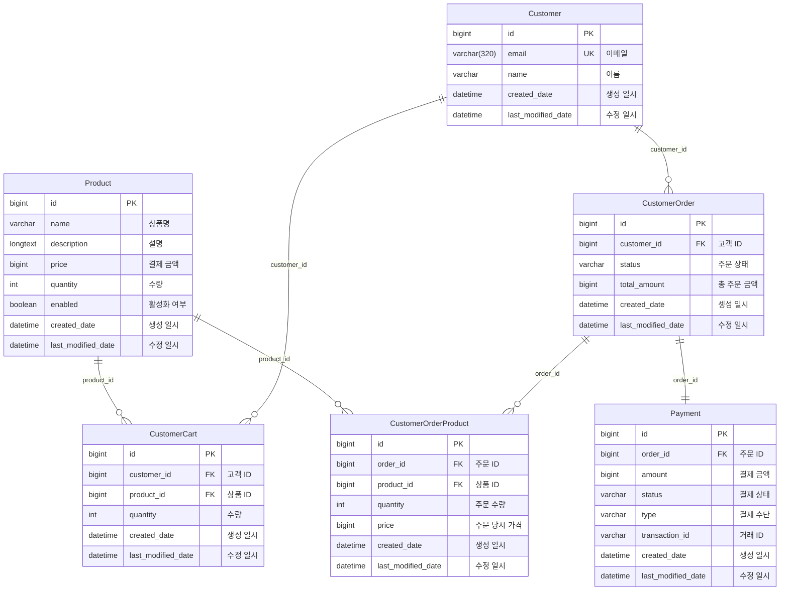

```mermaid
    erDiagram
    Product ||--o{ CustomerCart : product_id
    Product ||--o{ CustomerOrderProduct : product_id
    CustomerOrder ||--o{ CustomerOrderProduct : order_id
    CustomerOrder ||--|| Payment : order_id
    Customer ||--o{ CustomerCart : customer_id
    Customer ||--o{ CustomerOrder : customer_id

    Customer {
        bigint id PK
        varchar(320) email UK "이메일"
        varchar name "이름"
        datetime created_date "생성 일시"
        datetime last_modified_date "수정 일시"
    }

    Product {
        bigint id PK
        varchar name "상품명"
        longtext description "설명"
        bigint price "결제 금액"
        int quantity "수량"
        boolean enabled "활성화 여부"
        datetime created_date "생성 일시"
        datetime last_modified_date "수정 일시"
    }

    CustomerCart {
        bigint id PK 
        bigint customer_id FK "고객 ID"
        bigint product_id FK "상품 ID"
        int quantity "수량"
        datetime created_date "생성 일시"
        datetime last_modified_date "수정 일시"
    }

    CustomerOrder {
        bigint id PK
        bigint customer_id FK "고객 ID"
        varchar status "주문 상태"
        bigint total_amount "총 주문 금액"
        datetime created_date "셍성 일시"
        datetime last_modified_date "수정 일시"
    }

    CustomerOrderProduct {
        bigint id PK
        bigint order_id FK "주문 ID"
        bigint product_id FK "상품 ID"
        int quantity "주문 수량"
        bigint price "주문 당시 가격"
        datetime created_date "생성 일시"
        datetime last_modified_date "수정 일시"
    }

    Payment {
        bigint id PK 
        bigint order_id FK "주문 ID"
        bigint amount "결제 금액"
        varchar status "결제 상태"
        varchar type "결제 수단"
        varchar transaction_id "거래 ID"
        datetime created_date "생성 일시"
        datetime last_modified_date "수정 일시"
    }
```